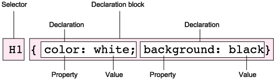

**Anatomy of a CSS Rule**

**Grouping selectors**

To apply the same style to two or more selectors:
       
       h1, p {font: verdana;}

**Grouping declarations**

To apply two or more styles in one CSS rule:

        td {font-size: small; background: yellow;}

**CSS comments**

CSS comments are ignored by browsers. This is how they are written:

        /* this is a CSS comment */
        /* CSS comments can span several lines
        and this is how to write them */

**Spaces and Line Breaks**

Spaces and line breaks in CSS code are ignored by browsers.

**Case Sensitivity**

CSS is not case sensitive except for names of font families, files, classes and ids.
